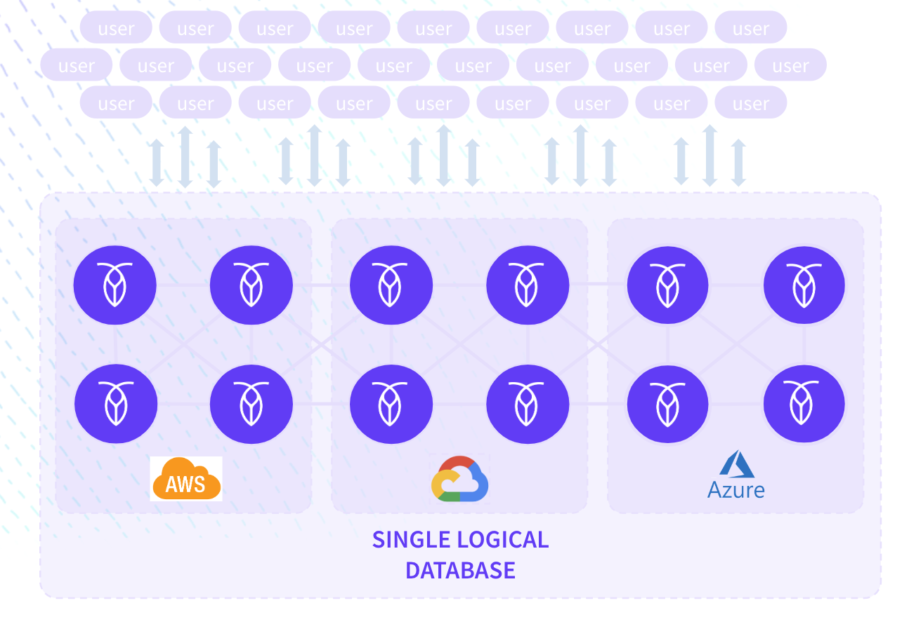

# CockroachDB Multi Cloud Kubernetes Deployment 

In this demo you will deploy a Kubernetes cluster into each of the cloud providers using their hosted offerings. Once this is deployed you will join the networks together using VPNs, and deploy CockroachDB across all three cloud providers. This will create a single logical database that spans all clouds giving you a platform to deploy your multi-cloud applications.

Multi-cloud is often used to refer to when a business decides to use more than one cloud to deliver its applications. By doing this it enables organizations to take advantage of the best of bread services provided by each of the cloud providers involved. A multi-cloud deployment could include a combination of public cloud providers or private cloud or a combination of both. In the case of CockroachDB it would be three or more due to the RAFT Consensus algorithm used to manage data resilience.

With a multi cloud application you can:

- Power a single application with data stored across multiple clouds.
- Use data that is created in one cloud to perform analysis in another cloud without having to manage or maintain manual data movement.
- Enhance the mobility of applications by being able to move them from one cloud to another.



## Why is multi-cloud important?
Putting all your eggs in one basket with a single provider could prove to be a risky approach. No one is immune to outages and that includes the big cloud providers. By spreading the risk across multiple cloud providers you are mitigating the chance of an outage affecting your end  customers. Also each cloud provider has their forte, the services that they do best. By spreading your data across cloud providers you are able to take advantage of the best of bread services each cloud offers like analytics servers in GCP for example.

## Get Hands On!

You will need the following installed on your laptop to run this demo the following.

- [AWS CLI](https://docs.aws.amazon.com/cli/latest/userguide/getting-started-install.html)
- [Azure CLI](https://learn.microsoft.com/en-us/cli/azure/install-azure-cli)
- [Google Cloud CLI](https://cloud.google.com/sdk/docs/install)
- [Cockroach Binary](https://www.cockroachlabs.com/docs/releases/)
- [kubectl](https://kubernetes.io/docs/tasks/tools/)

This demo will be broken down into a number of stages. Follow each stage in turn to create your multi cloud cluster.

1. [Create a Kubernetes cluster in Azure, AWS and Google.](markdown/1-create-kubernetes-clusters.md)
2. [Create VPN Devices in all clouds.](markdown/2-create-vpn-devices.md)
3. [Configure VPN connections between clouds.](markdown/3-create-vpn-connections.md)
4. [Test your network.](markdown/4-test-network-connections.md)
5. [Deploy CockroachDB across the three cloud providers.](markdown/5-deploy-cockroach.md)


# Clean Up

Resources in the cloud can be expensive and this demo is no exception. Below is a teardown script designed to remove all the resources created.

```
cd scripts
chmod 755 teardown.sh
./teardown.sh
```